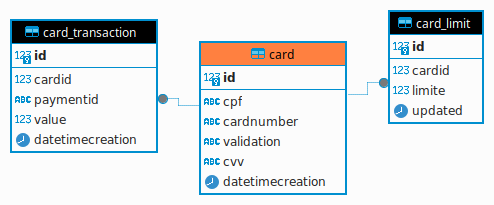

# FIAP Hackathon
## API para gestão de cartões

Este repositório refere-se ao microsserviço de usuários para atender aos requisitos do desafio proposto pelo
MBA em desenvolvimento Java, este projeto envolve a comunicação entre microserviços.

## Principais recursos deste microserviço

Responsável por cadastrar informações dos usuarios, assim será possível:
* Incluir novos usuários;
* gerar token para autorização no serviço;
* Consultar usuários do sistema;

## Tecnologias

* Spring Boot para a estrutura do serviço
* Spring Data JPA para manipulação de dados dos cartões
* Flyway para migração de banco de dados
* PostgreSQL para persistência

## Desenvolvedores

- [Aydan Amorim](https://github.com/AydanAmorim)
- [Danilo Faccio](https://github.com/DFaccio)
- [Erick Ribeiro](https://github.com/erickmatheusribeiro)
- [Isabela França](https://github.com/fysabelah)

## Operações suportadas paela API
### Cadastro de Cartão
A operação de cadastro de cartão é realizada através do método POST `/api/cartao` e recebe como parâmetros o CPF do usuário, o número do cartão, a data de validade e o CVV do cartão.

**Exemplo Request:**
```json
{
  "cpf": "21910056081",
  "limite": 1000,
  "numero": "5568872479420825",
  "data_validade": "0625",
  "cvv": "545"
}
```
**Exemplo de resposta positiva:**
```json
{
  "cpf": "21910056081",
  "numero": "5568872479420820",
  "data_validade": "0625",
  "cvv": "545"
}
```
**Exemplo de resposta negativa:**
```json
{
  "statusCode": 500,
  "error": "Código do erro",
  "message": "Motivo do erro",
  "path": "/api/cartao"
}
```
### Consulta de Saldo do Cartão
A operação de consulta de saldo do cartão é realizada através do método GET `/api/cartao` e recebe como parâmetros o CPF do usuário, o número do cartão, a data de validade e o CVV do cartão.

**Exemplo Request:**
```json
curl 'http://localhost:7074/api/cartao?cpf=21910056081&numero=5568872479420825&data=0625&cvv=545' \
-H 'Accept-Language: en-US,en;q=0.9,pt;q=0.8' \
-H 'Connection: keep-alive' \
-H 'Referer: http://localhost:7074/doc/swagger-ui/index.html' \
-H 'Sec-Fetch-Dest: empty' \
-H 'Sec-Fetch-Mode: cors' \
-H 'Sec-Fetch-Site: same-origin' \
-H 'User-Agent: Mozilla/5.0 (X11; Linux x86_64) AppleWebKit/537.36 (KHTML, like Gecko) Chrome/126.0.0.0 Safari/537.36' \
-H 'accept: */*' \
-H 'sec-ch-ua: "Not/A)Brand";v="8", "Chromium";v="126", "Google Chrome";v="126"' \
-H 'sec-ch-ua-mobile: ?0' \
-H 'sec-ch-ua-platform: "Linux"'
```
**Exemplo de resposta positiva:**
```json
{
  "limit": 1000,
  "updated": "2024-08-06T23:46:33.061716"
}
```
**Exemplo de resposta negativa:**
```json
{
  "statusCode": 500,
  "error": "Código do erro",
  "message": "Motivo do erro",
  "path": "/api/cartao"
}
```
### Inclusão de Movimentação do Cartão
A operação de inclusão de movimentação do cartão é realizada através do método POST `/api/cartao/transactions` e recebe como parâmetros o CPF do usuário, o número do cartão, a data de validade, o CVV do cartão e o valor da movimentação.

**Exemplo Request:**
```json
{
  "cpf": "21910056081",
  "numero": "5568872479420825",
  "paymentid": "12345678901",
  "data_validade": "0625",
  "cvv": "545",
  "valor": 100
}
```
**Exemplo de resposta positiva:**
```json
{
  "id": "1",
  "paymentId": "12345678901",
  "value": 100,
  "created": "2024-08-07T20:53:32.164772222"
}
```

**Exemplo de resposta negativa:**
```json
{
  "statusCode": 500,
  "error": "Código do erro",
  "message": "Motivo do erro",
  "path": "/api/cartao"
}
```

## Estrutura da base de dados
* Para registrar os pagamentos foi criado três entidades, sendo elas:
  * **Card**: Responsavel por registrar os dados de uma cartão de crédito.
  * **card_limit**: Responsável por registrar os dados de limite de uso de uma cartão.
  * **card_transaction**: Responsável por registrar os dados de um pagamento.


